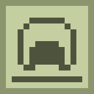

# needle [![1][1]][6]  [![2][2]][4]  [![3][3]][5] [![10][10]][11] 

[][8] [][9]

tap to add text

[1]: https://img.shields.io/badge/minecraft-1.15+-brightgreen
[2]: https://img.shields.io/badge/loader-Fabric-blue
[3]: https://img.shields.io/badge/code_quality-F-red
[4]: https://fabricmc.net
[5]: https://git.io/code-quality
[6]: https://minecraft.net
[7]: src/main/resources/assets/storagenetworks/icon.png
[8]: https://www.curseforge.com/minecraft/mc-mods/fabric-api
[9]: https://www.curseforge.com/minecraft/mc-mods/fabric-language-kotlin
[10]: https://img.shields.io/badge/dynamic/json?color=orange&label=downloads&query=downloadCount&url=https%3A%2F%2Faddons-ecs.forgesvc.net%2Fapi%2Fv2%2Faddon%2F391014&logo=data:image/png;base64,iVBORw0KGgoAAAANSUhEUgAAACsAAAAXCAYAAACS5bYWAAAABmJLR0QA/wD/AP+gvaeTAAAB80lEQVRIib2WsUuVURjGn2NhUjSZQ7Rli6mL1SBtQYNgpi2FIOjmVEpb0H8Q1GRIpIMkQkG4VIjicKElaZEGxTGC0qFAQQX7NXynOH18373nHM+9D9zhnu993ufH+d57zzEKEPBc0niIJ6WaAusrdaHwVCjsx8icZUlvJe1H+iVJBtiS1H6cJjU0IemHpPlj9NiUVBEwTv20DRjgRYT3AJgBLv9Dts0WEgK62gVOAfcDfStA8dsGTgJPgd8JQSvABjBkgdc9fU+AEzUHA7gCLCWCncv17vXwTAVPM9AOPAQ+AD8jYXeBbqfnM+CoSv060FyNy3iAN0m6KOmS/VyQ1CqpTdJggWVG0oCkc5LWjDHXbJ9H1j9WEnXDGLNaiydawOfc7izb9e/2+1qufhb4VLCr9T9sgAe50Md2/RbZCPU5tR12DEaAvZzvXiNg24BDJ3S6Sm0n8B44C6w6nj2gpe6wFmLRCf5F2f/j/54vjuddIzj/Bt/JvdKvQD9Q+OMF7ubqJxsJ2wxMAZsF0AtAF9kpeRN47YzNPjANdDQM1oEepVjfgFcF629CM0KviGWgpyVdLXl8XtJwwfoZoCdFfpDIzv8YvQzJSbKzkm5H+vrxubSkEtmNbSdyZwGu+2al2NleZXeFWA34FqaA9Q4rkfcI/QF8wa/Bkt5sxwAAAABJRU5ErkJggg==
[11]: https://www.curseforge.com/minecraft/mc-mods/slotlink
